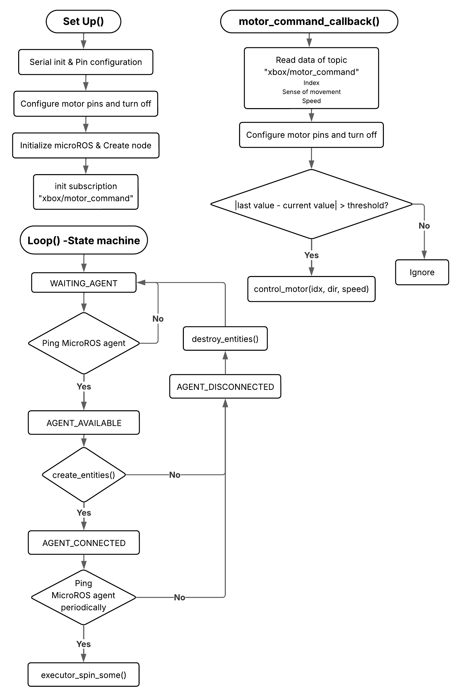

# Aquabotics PlatformIO Project

This repository contains the PlatformIO firmware for **Aquabotics**—the ESP32-S3 client that receives motor commands over micro-ROS and drives the L298N motor controllers on the ROV.

---

## 📂 Repository Structure

```
aquabotics_platformIO/
├── README.md
├── images/
│ └── motor_state_machine.png
├── src/
│ └── main.cpp
├── include/
│ └── config.h
├── platformio.ini
└── lib/
├── micro_ros_arduino/
└── utils/
```

- **platformio.ini**  
  Defines the ESP32-S3 board, upload and monitor speeds, and library dependencies (e.g., `micro_ros_arduino`).

- **src/main.cpp**  
  - `setup()`:  
    - Initializes serial ports and configures GPIO pins for motor enable/in1/in2  
    - Initializes micro-ROS, creates a node, and subscribes to `"xbox/motor_command"`  
  - `loop()`:  
    - Runs a state machine that pings the micro-ROS agent, creates/destroys entities, and spins the executor  
    - When a motor command arrives, calls `motor_command_callback()`  
  - `motor_command_callback()`:  
    - Reads index, direction, and speed  
    - Applies a change-threshold filter  
    - Calls `control_motor(idx, dir, speed)` to drive the L298N

- **include/config.h**  
  Pin definitions, dead-zone thresholds, and micro-ROS settings.

- **lib/**  
  - `micro_ros_arduino/`: Micro-ROS Arduino transport and helper APIs  
  - `utils/`: Helper functions for debugging and error handling

---

## 🚀 Prerequisites

- [PlatformIO](https://platformio.org/) extension (VSCode or CLI)  
- ESP32-S3 Development Board  
- L298N motor driver modules  
- USB-serial cable for programming and micro-ROS agent connectivity

---

## ⚙️ Build & Upload

1. Open the project in VSCode with the PlatformIO extension

---

## ▶️ Usage

1. Start your micro-ROS agent on the host computer:
```bash
ros2 run micro_ros_agent micro_ros_agent serial --dev /dev/ttyACM0
```

2. Upload the firmware to the ESP32-S3 and open the serial monitor. You should see logs indicating:
- Agent ping successes/failures
- Subscription creation
- Incoming motor commands and state transitions

3. Use the Aquabotics ROS 2 `joy_controller` to publish to `"xbox/motor_command"` and watch the ROV motors respond.

---

## 📈 Main State Machine Diagram


1. Left: `setup()` flow—serial/GPIO init, micro-ROS node creation, subscription setup.
2. Right: `motor_command_callback()` logic—filtering small changes, then calling `control_motor(idx, dir, speed)`.
3. Bottom: `loop()` state machine—ping agent, create/destroy entities, spin executor.
